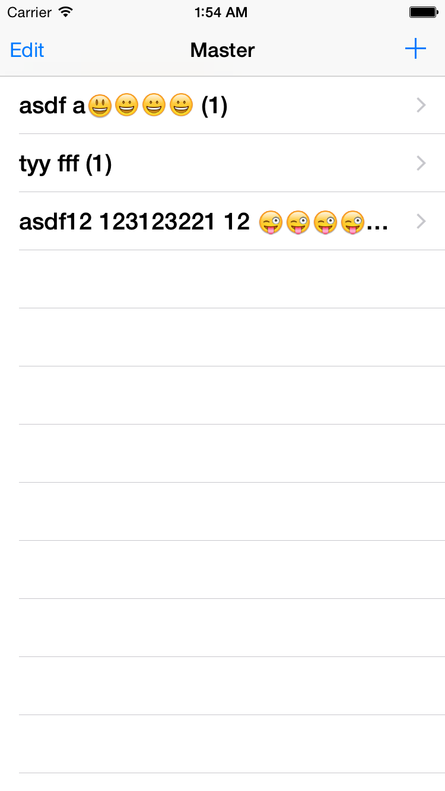

# SQLite3Demo (DBManager.h/.m)

Demonstration for using SQLite3 for CRUD.

* It has a sample SQLite file.

* Programe will copy into app's directory.

# How to use

`
@property (nonatomic, strong) DBManager *dbManager;

// at viewdidload
// Initialize the dbManager object.
self.dbManager = [[DBManager alloc] initWithDatabaseFilename:@"sampledb.sqlite"];
`

## Querying (Read)

`
NSString *query = @"select * from peopleInfo";

// Get the results.
if (self.arrPeopleInfo != nil) {
self.arrPeopleInfo = nil;
}
self.arrPeopleInfo = [[NSArray alloc] initWithArray:[self.dbManager loadDataFromDB:query]];
`

## Create 

`
[self.dbManager executeQuery:query];
`

## Delete 

`
int recordIDToDelete = [self.arrPeopleInfo[indexPath.row][0] intValue];

// Prepare the query.
NSString *query = [NSString stringWithFormat:@"delete from peopleInfo where peopleInfoID=%d", recordIDToDelete];
`

## Update 

`
NSString *query = [NSString stringWithFormat:@"update peopleInfo set firstname='%@', lastname='%@', age=%d where peopleInfoID=%d", self.tf_firstName.text, self.tf_secondName.text, self.tf_age.text.intValue, [self.detailItem[0] intValue]];

// Execute the query.
[self.dbManager executeQuery:query];

// If the query was successfully executed then pop the view controller.
if (self.dbManager.affectedRows != 0) {
NSLog(@"Query was executed successfully. Affected rows = %d", self.dbManager.affectedRows);

}
else{
NSLog(@"Could not execute the query.");
}
`

# About

Based on tutorial: http://www.appcoda.com/sqlite-database-ios-app-tutorial/

-----

Developed by iReka Soft 